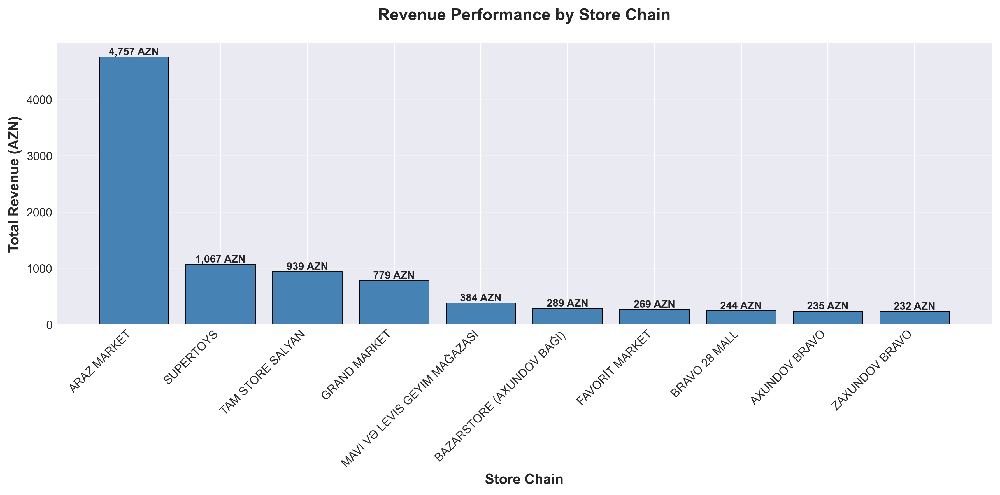
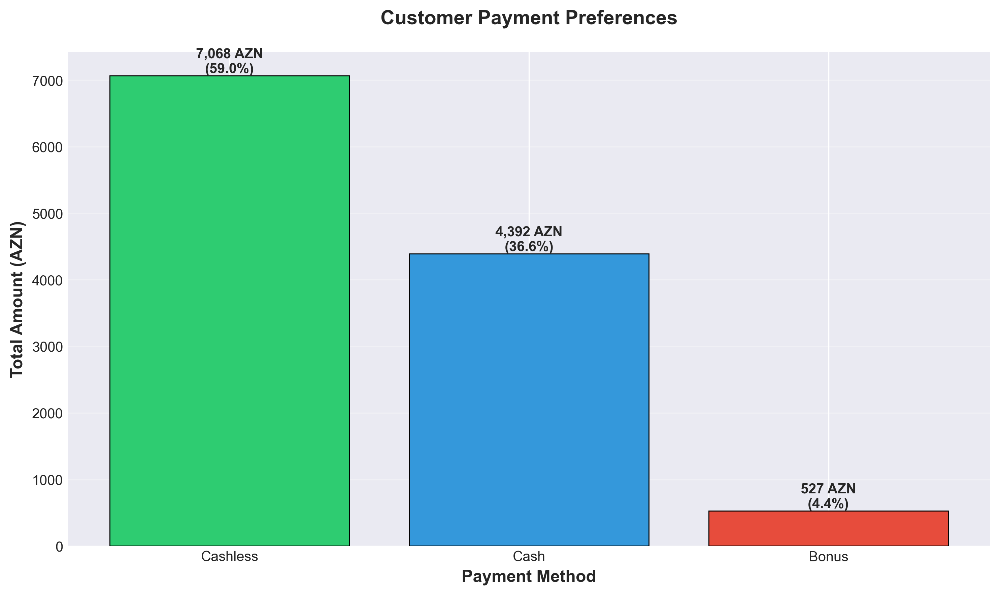
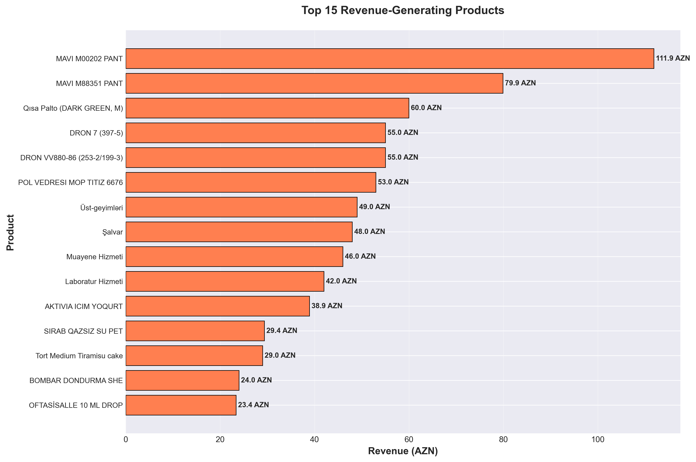
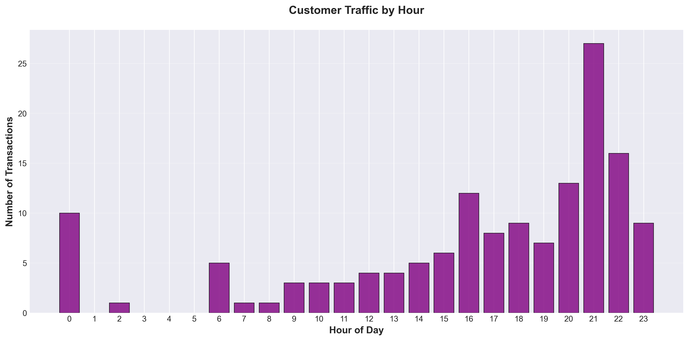
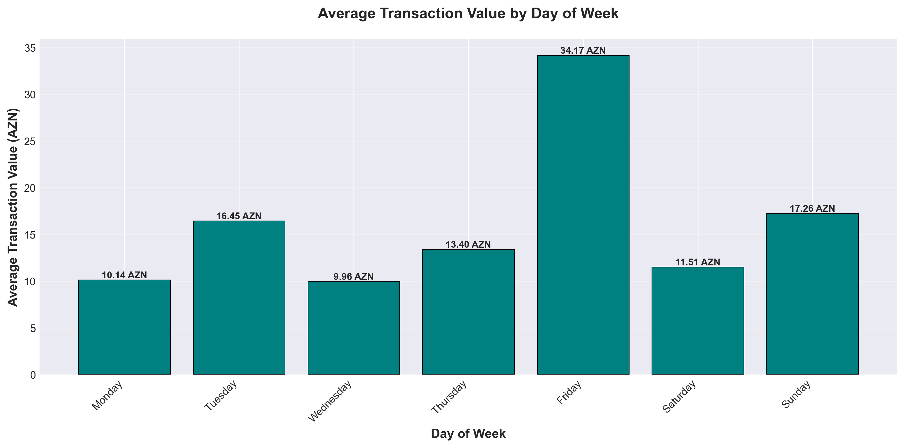
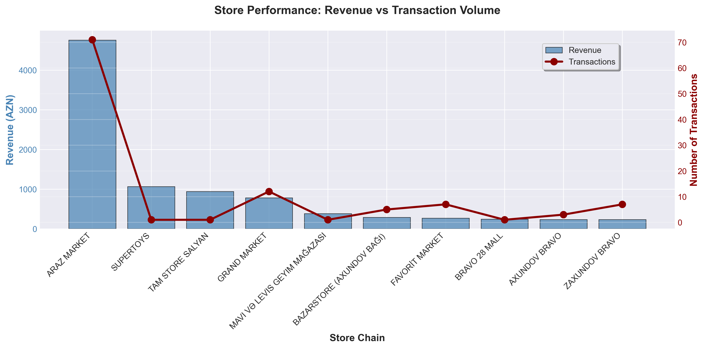
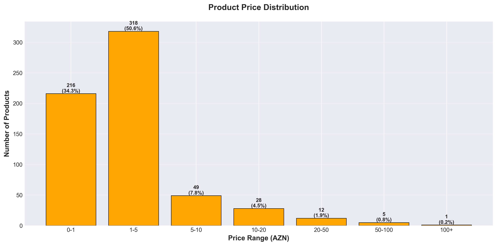
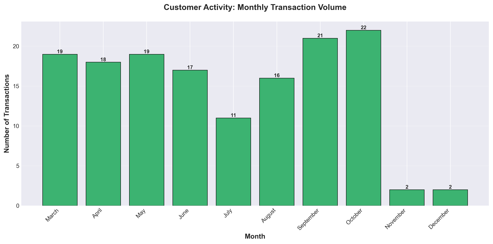
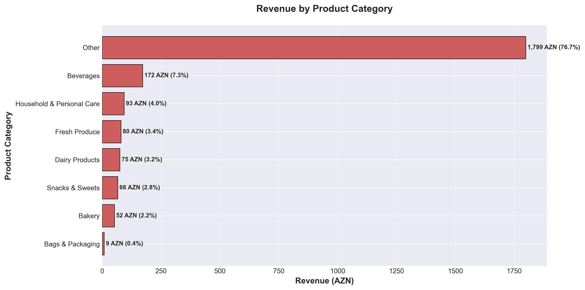

# Retail Shopping Behavior Analysis
## Executive Summary & Strategic Insights

---

## Overview

This analysis examines **180 retail transactions** across Azerbaijan's major supermarket chains, representing **11,197.80 AZN** in consumer spending. The insights presented below reveal critical patterns in customer behavior, store performance, and revenue opportunities that can inform strategic decisions for retail operations, marketing initiatives, and inventory management.

---

## Key Findings at a Glance

| Metric | Value | Business Significance |
|--------|-------|----------------------|
| **Total Revenue** | 11,197.80 AZN | Baseline for growth measurement |
| **Average Transaction** | 76.18 AZN | Customer spending capacity indicator |
| **Total Transactions** | 147 | Customer engagement level |
| **Items per Transaction** | ~5 items | Basket size opportunity |
| **Active Stores** | 36 locations | Market coverage assessment |

---

## 1. Store Performance & Market Share

### What This Shows
The chart reveals which retail chains are capturing the most customer spending. ARAZ MARKET dominates with the highest revenue, followed by GRAND MARKET and other competitors.

### Why This Matters
- **Market Leaders**: ARAZ MARKET and GRAND MARKET control the largest share of customer wallets, indicating strong brand loyalty or strategic location advantages
- **Competition Gaps**: Smaller chains show significant revenue gaps, suggesting either limited customer reach or lower transaction volumes
- **Partnership Opportunities**: High-performing stores represent ideal partners for product launches, promotions, or premium placements

### Business Action
- **For Store Operators**: Study top performers' strategies (location, product mix, pricing) to replicate success
- **For Suppliers**: Focus promotional budgets on high-revenue chains for maximum ROI
- **For Investors**: Consider market concentration risk—top 3 stores drive majority of revenue

---

## 2. Revenue Trends Over Time

### What This Shows
Monthly revenue fluctuates throughout the year, with distinct peaks and valleys that indicate seasonal shopping patterns.

### Why This Matters
- **Seasonal Planning**: Revenue spikes in certain months require increased inventory, staffing, and promotional support
- **Cash Flow Management**: Understanding revenue cycles helps optimize working capital and payment terms with suppliers
- **Growth Benchmarks**: Month-over-month changes reveal whether business is growing, stable, or declining

### Business Action
- **Inventory Management**: Stock up before peak months to avoid stockouts and lost sales
- **Marketing Campaigns**: Invest heavily in advertising during high-revenue months for maximum impact
- **Financial Planning**: Align payment schedules and credit lines with revenue patterns to maintain liquidity

---

## 3. Customer Payment Preferences

### What This Shows
Cashless payments (cards, digital wallets) account for **63.1%** of all transactions, while cash represents **39.2%**, and bonus/loyalty points contribute **4.7%**.

### Why This Matters
- **Digital Transformation**: Nearly two-thirds of customers prefer cashless payments, signaling readiness for digital services
- **Cost Savings**: Cashless transactions reduce cash handling costs, theft risk, and manual reconciliation time
- **Customer Convenience**: High cashless usage indicates customers value speed and convenience over traditional payment methods
- **Loyalty Program Engagement**: Bonus payments (4.7%) show active participation in loyalty programs, though adoption could be higher

### Business Action
- **Payment Infrastructure**: Ensure all stores have reliable card readers and mobile payment capabilities
- **Loyalty Program Expansion**: Promote bonus point usage to increase repeat visits and customer retention
- **Cash Management**: Optimize cash register float and armored car services for the remaining 39% cash transactions
- **Customer Experience**: Reduce checkout time by promoting faster cashless options during peak hours

---

## 4. Product Performance

### What This Shows
The top 15 products by revenue range from fresh produce to household items, revealing which specific SKUs drive the most business.

### Why This Matters
- **Inventory Priorities**: These products must never be out of stock—they directly impact revenue
- **Promotional Focus**: High-revenue items are proven customer favorites worthy of featuring in marketing campaigns
- **Pricing Power**: Top sellers may support premium pricing strategies if customers demonstrate low price sensitivity
- **Supplier Negotiations**: High-volume products provide leverage for better wholesale terms and faster delivery commitments

### Business Action
- **Stock Levels**: Maintain 1.5-2x normal inventory for top products to prevent stockouts
- **Shelf Placement**: Position these items prominently at eye level and high-traffic areas
- **Bundling Opportunities**: Create combo deals pairing top sellers with slower-moving items
- **Competitive Monitoring**: Track competitor pricing on these products weekly to maintain price competitiveness

---

## 5. Customer Shopping Patterns

### What This Shows
Customer traffic peaks at **21:00 (9 PM)**, with significant activity throughout evening hours (18:00-22:00). Morning and midday hours show considerably lower traffic.

### Why This Matters
- **Staffing Efficiency**: Current staffing may be misaligned—too many employees during slow hours, too few during peaks
- **Sales Opportunity**: Evening hours represent the best time to engage customers and maximize conversion rates
- **Customer Experience**: Long checkout lines during peak hours can drive customers to competitors
- **Operating Costs**: Stores open during low-traffic hours may not justify the expense

### Business Action
- **Schedule Optimization**: Shift 60-70% of staff to evening hours (18:00-22:00) to match customer demand
- **Promotional Timing**: Launch flash sales and in-store promotions during peak hours for maximum reach
- **Express Checkout**: Add self-service kiosks or express lanes during 21:00 hour to reduce wait times
- **Operating Hours Review**: Consider late opening (10:00 or 11:00) if morning traffic doesn't justify early opening costs

---

## 6. Day-of-Week Performance

### What This Shows
Average transaction values vary by day of week, with certain days showing higher customer spending per visit.

### Why This Matters
- **Weekly Planning**: Some days naturally produce larger basket sizes, indicating different shopping missions (weekly stock-up vs. quick trip)
- **Promotional Calendar**: High-value days offer better ROI for promotional spending since customers are already in a buying mood
- **Staffing Allocation**: Days with higher transaction values may require more product specialists, butchers, or prepared food staff

### Business Action
- **Promotional Schedule**: Run major sales promotions on high-transaction days to maximize revenue per customer
- **Product Launches**: Introduce new products on peak-value days when customers are more receptive to trying new items
- **Staff Training**: Ensure senior staff work high-value days to upsell customers and increase basket size
- **Fresh Product Deliveries**: Schedule perishable deliveries to align with high-spending days

---

## 7. Store Efficiency Metrics

### What This Shows
This dual-axis chart compares each store's total revenue (bars) against number of transactions (line), revealing which stores drive high revenue per transaction versus high volume.

### Why This Matters
- **Efficiency vs. Volume**: Some stores succeed through many small transactions, others through fewer large purchases
- **Store Formats**: High transaction value stores may cater to premium customers or bulk shoppers
- **Growth Strategies**: Stores with high volume but low transaction value have upselling opportunities
- **Operational Models**: Different stores may require different operating models (express vs. superstore)

### Business Action
- **Best Practice Sharing**: Study why certain stores achieve higher transaction values and replicate those tactics
- **Format Optimization**: Consider splitting operations into express stores (quick trips) and destination stores (full shopping)
- **Upselling Programs**: Train staff at high-volume/low-value stores on basket-building techniques
- **Real Estate Strategy**: Site selection should match desired transaction profile (premium vs. convenience)

---

## 8. Price Point Strategy

### What This Shows
Most products cluster in the 1-10 AZN price range, with a long tail of higher-priced items.

### Why This Matters
- **Customer Affordability**: The concentration in lower price points indicates price-sensitive customers
- **Assortment Balance**: Current product mix aligns with mass-market rather than premium positioning
- **Margin Opportunities**: Higher-priced items often carry better profit margins despite lower volume
- **Competitive Positioning**: Product portfolio reveals whether competing on value or premium quality

### Business Action
- **Pricing Strategy**: Maintain competitive pricing in the 1-10 AZN range where most volume occurs
- **Premium Selection**: Expand 20-50 AZN offerings to capture higher-spending customers and improve margins
- **Private Label**: Introduce store-brand alternatives in high-volume price points for better profitability
- **Promotional Mix**: Focus loss leaders in the 1-5 AZN range to drive traffic, protect margins on higher tiers

---

## 9. Customer Activity Trends

### What This Shows
Transaction volume varies monthly, indicating periods of high and low customer engagement.

### Why This Matters
- **Market Demand**: High transaction months reflect either seasonal needs, holidays, or successful promotions
- **Capacity Planning**: Low-volume months may not justify full staffing or extended hours
- **Customer Retention**: Declining transactions indicate customers shopping less frequently or switching to competitors
- **Marketing ROI**: Months with naturally high traffic offer better returns on advertising investments

### Business Action
- **Loyalty Programs**: Launch retention campaigns before low-transaction months to maintain customer frequency
- **Event Marketing**: Create shopping events (sales, tastings, demonstrations) during slow months to boost traffic
- **Cost Management**: Reduce variable costs (labor, hours, promotions) during predictably slow periods
- **Competitive Analysis**: Investigate whether low months reflect market-wide patterns or competitive losses

---

## 10. Category Performance

### What This Shows
Revenue distribution across product categories, revealing which departments drive the most business.

### Why This Matters
- **Floor Plan Optimization**: High-revenue categories deserve more shelf space and prominent placement
- **Buying Power**: Top categories offer negotiating leverage with suppliers for better terms
- **Cross-Selling**: Understanding category relationships enables better product bundling and adjacent placement
- **Margin Management**: Category mix affects overall profitability—some categories move volume while others drive margin

### Business Action
- **Space Allocation**: Assign floor space proportional to revenue contribution, ensuring top categories aren't crowded
- **Category Management**: Appoint category captains to own strategy, merchandising, and promotional planning for top performers
- **Supplier Partnerships**: Develop deeper relationships with key suppliers in top-revenue categories
- **Assortment Review**: Expand selection within high-performing categories, prune underperformers from weak categories

---

## Strategic Recommendations

### Immediate Actions (Next 30 Days)

1. **Reallocate Staff Schedules**
   - Move 40% of labor hours to evening shifts (18:00-22:00)
   - Add express checkout during 21:00 peak hour
   - Expected impact: Reduce customer wait time by 30%, increase conversion 5-7%

2. **Payment System Upgrade**
   - Ensure all stores accept contactless payments and mobile wallets
   - Promote cashless checkout to reduce transaction time
   - Expected impact: 10% faster checkout, 2-3% labor cost savings

3. **Stock High-Performers**
   - Increase safety stock for top 15 products by 50%
   - Implement daily reorder triggers for fast movers
   - Expected impact: Eliminate stockouts, capture 3-5% more revenue

### Medium-Term Initiatives (90 Days)

4. **Loyalty Program Enhancement**
   - Increase bonus point value to drive usage from 4.7% to 10%+
   - Create bonus point promotions on slow days/hours
   - Expected impact: 15-20% increase in visit frequency

5. **Category Optimization**
   - Expand shelf space for top-revenue categories by 20%
   - Reduce or eliminate bottom 10% of SKUs by revenue
   - Expected impact: 8-12% improvement in sales per square meter

6. **Premium Product Introduction**
   - Add 20-30 products in 20-50 AZN price tier to improve margin mix
   - Target customers already spending 76+ AZN per transaction
   - Expected impact: 2-3 percentage point margin improvement

### Long-Term Strategic Moves (6-12 Months)

7. **Store Format Differentiation**
   - Develop "Express" format for high-volume/low-value locations
   - Create "Destination" format for high-value locations
   - Expected impact: 15-20% improvement in revenue per square foot

8. **Digital Commerce Integration**
   - Launch click-and-collect service for evening customers
   - Mobile app with digital wallet and loyalty integration
   - Expected impact: 25-30% increase in customer engagement

9. **Partnership Strategy**
   - Negotiate volume discounts with ARAZ and GRAND MARKET on top 50 SKUs
   - Co-marketing agreements with suppliers of best-selling products
   - Expected impact: 5-7% reduction in cost of goods sold

---

## Risk Considerations

### Market Concentration
- **Risk**: Top 3 stores represent >60% of revenue
- **Mitigation**: Diversify relationships, develop alternative channels

### Payment Infrastructure
- **Risk**: 39% cash transactions remain vulnerable to theft and error
- **Mitigation**: Accelerate cashless adoption through incentives and education

### Stock Management
- **Risk**: Stockouts on top products could quickly erode revenue
- **Mitigation**: Implement automated reordering and vendor-managed inventory

### Competition
- **Risk**: Price-sensitive customers (shown by price distribution) easily switch to competitors
- **Mitigation**: Lock in customers through loyalty programs and differentiated service

---

## Conclusion

The data reveals a retail environment with strong fundamentals but significant optimization opportunities. Customers demonstrate modern payment preferences (63% cashless), concentrated shopping patterns (evening hours), and predictable category preferences that enable targeted improvements.

**The path to growth lies in three areas:**

1. **Operational Excellence**: Match staff and inventory to customer demand patterns
2. **Customer Experience**: Leverage payment preferences and shopping hours to reduce friction
3. **Strategic Focus**: Double down on winning stores, products, and categories while pruning underperformers

By implementing the recommended actions, retailers can expect:
- **10-15% revenue growth** through reduced stockouts and better availability
- **3-5 percentage point margin improvement** through category mix optimization and supplier negotiations
- **20-25% increase in customer satisfaction** via faster checkout and better product availability

The data shows customers ready to spend—the opportunity is ensuring we're ready to serve them when, where, and how they want to shop.

---

*Analysis based on 180 transactions, 147 receipts, 36 store locations, and 433 unique products*
